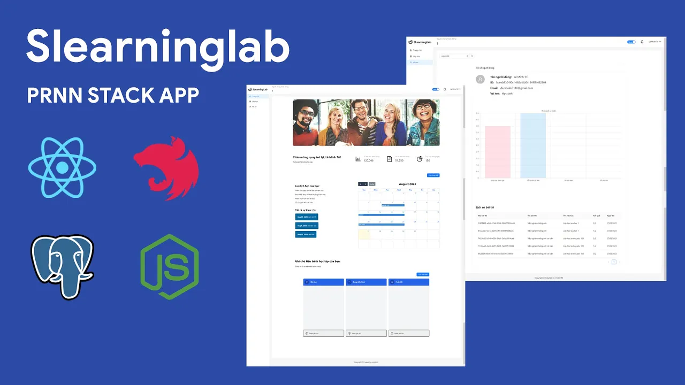

# SLEARNING LAB DOCUMENTATION

 



🎓 📚 Education & Learning support project app inspired from [Google classroom](https://classroom.google.com)

This project includes two repository (Client and Server), you can checkout **[server repository](https://github.com/minhtrifit/slearninglab-server)**

## 💻 Technical Stack

<p align="left"> <a href="https://reactjs.org/" target="_blank" rel="noreferrer">  </a> <a href="https://redux.js.org" target="_blank" rel="noreferrer">  </a> <a href="https://tailwindcss.com/" target="_blank" rel="noreferrer">  </a> <a href="https://www.typescriptlang.org/" target="_blank" rel="noreferrer">  </a> </p>

- [React.js](https://react.dev) - The library for web and native user interfaces
- [Redux Toolkit](https://redux-toolkit.js.org) - The official, opinionated, batteries-included toolset for efficient Redux development
- [Tailwind CSS](https://tailwindcss.com) - Rapidly build modern websites without ever leaving your HTML
- [TypeScript](https://www.typescriptlang.org) - JavaScript with syntax for types.

## ⚙️ Config .env file

Config [.env]() file in root dir with path `./.env`

```bash
VITE_API_URL=yourserverurl
VITE_CLOUDINARY_PRESETNAME=yourcdrpresetname
VITE_CLOUDINARY_APIKEY=yourcdrapikey
VITE_CLOUDINARY_CLOUDNAME=yourcdrcloudname
```

## 📦 Installation

Intall packages & dependencies
```console
npm install
```

Or install packages with legacy peer dependencies.
```console
npm install --legacy-peer-deps
```

Run client project (supported by [Vite](https://vitejs.dev))
```console
npm run dev
```

# ⚡️ Project Showcase

Login Page:

* Using JWT Authentication


Home Page:

* Project stats showcase
* DnD Calender
* DnD To do list


Class Page:

* 👨‍🎓 Student role: View class can join, joined classes.
* 👩‍🏫 Teacher role: View class that them manage.


Exam Page:

* 👨‍🎓 Student role: Do quiz test created by teacher.
* 👩‍🏫 Teacher role: Create quiz for student.


Chat Page:

* 👦👧 User role: Real time chat


Document Page:

* 👨‍🎓 Student role: Uploaded pdf documents.
* 👩‍🏫 Teacher role: Downloaded documents.


Profile Page:

* 👦👧 User role: Searching for other user activity.


## ▶️ YouTube Demo

[](https://youtu.be/g9WHplySekY)

## 💌 Contact

- Author - [minhtrifit](https://minhtrifitdev.netlify.app)
- [Github](https://github.com/minhtrifit)

> CopyRight© minhtrifit
